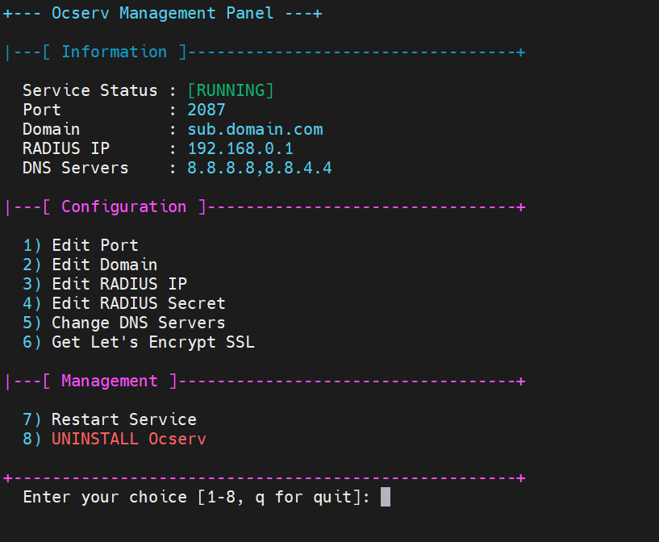

# نصب آسان Ocserv با پنل تنظیم

<div dir="rtl">



## 📋 معرفی

این اسکریپت یک نصب‌کننده و پنل مدیریت پیشرفته برای Ocserv است که امکان نصب، پیکربندی و مدیریت آسان سرور OpenConnect را فراهم می‌کند. این اسکریپت به صورت خودکار تمام مراحل نصب را انجام داده و یک پنل مدیریت حرفه‌ای برای کنترل سرور نصب می‌کند.

## 🎯 ویژگی‌ها

- ✅ نصب خودکار و کامل Ocserv
- ✅ پیکربندی RADIUS برای احراز هویت
- ✅ سازگاری کامل با IBSng برای مدیریت کاربران و صورتحساب‌ها
- ✅ پنل تنظیمات گرافیکی در محیط ترمینال
- ✅ پشتیبانی از گواهی‌نامه SSL رایگان Let's Encrypt
- ✅ پیکربندی خودکار فایروال و مسیریابی
- ✅ امکان تغییر پورت، دامنه و تنظیمات DNS
- ✅ پشتیبانی از چندین سرور DNS (سیستم، گوگل، کلودفلر، OpenDNS)
- ✅ قابلیت تغییر پیکربندی RADIUS بدون نیاز به راه‌اندازی مجدد
- ✅ نصب و پیکربندی SSL به صورت خودکار
- ✅ مدیریت آسان سرویس (راه‌اندازی مجدد، حذف کامل)

## 🔧 پیش‌نیازها

- سیستم‌عامل Ubuntu 22
- دسترسی root
- حداقل 1GB RAM
- سرور RADIUS فعال و در دسترس
- دامنه (اختیاری - برای SSL رایگان)

## ⚡ نصب سریع

برای نصب سریع با یک دستور:

```bash
curl -sSL https://raw.githubusercontent.com/ArashAfkandeh/Ocserv-Installer/main/install_ocserv.sh | sudo bash
```

## 📝 پارامترهای نصب

نصب با پارامترها برای محیط‌های غیر تعاملی:

```bash
curl -sSL https://raw.githubusercontent.com/ArashAfkandeh/Ocserv-Installer/main/install_ocserv.sh | sudo bash -s -- [PORT] [DOMAIN] [RADIUS_IP] [RADIUS_SECRET] [DNS_CHOICE]
```

مثال:
```bash
curl -sSL https://raw.githubusercontent.com/ArashAfkandeh/Ocserv-Installer/main/install_ocserv.sh | sudo bash -s -- '443' 'vpn.domain.com' '192.168.1.100' 'mysecret' '2'
```

پارامترها:
- `PORT`: پورت سرور (پیش‌فرض: درخواست از کاربر)
- `DOMAIN`: دامنه پیش‌فرض (پیش‌فرض: درخواست از کاربر)
- `RADIUS_IP`: آدرس IP سرور RADIUS (پیش‌فرض: درخواست از کاربر)
- `RADIUS_SECRET`: کلید مشترک RADIUS (پیش‌فرض: درخواست از کاربر)
- `DNS_CHOICE`: انتخاب سرور DNS (1: سیستم، 2: گوگل، 3: کلودفلر، 4: OpenDNS)

## 🎮 امکانات پنل مدیریت

بعد از نصب، می‌توانید با دستور زیر به پنل تنظیمات دسترسی پیدا کنید:
```bash
sudo oc-p
```

امکانات پنل:
1. 🔄 تغییر پورت سرور
2. 🌐 تغییر دامنه پیش‌فرض
3. 🔑 تغییر IP سرور RADIUS
4. 🔒 تغییر کلید مشترک RADIUS
5. 📡 تغییر سرورهای DNS
6. 🔰 نصب گواهی SSL رایگان Let's Encrypt
7. 🔄 راه‌اندازی مجدد سرویس
8. ❌ حذف کامل Ocserv

## 🔒 پشتیبانی از SSL رایگان

این اسکریپت از گواهی‌نامه‌های رایگان Let's Encrypt پشتیبانی می‌کند. برای نصب SSL:
1. مطمئن شوید که دامنه شما به سرور اشاره می‌کند
2. از گزینه 6 در پنل مدیریت استفاده کنید
3. یک آدرس ایمیل معتبر وارد کنید
4. صبر کنید تا فرآیند صدور گواهی کامل شود

نکات مهم SSL:
- تمدید خودکار گواهی SSL نیز پیکربندی می‌شود
- پورت 80 باید در زمان صدور گواهی در دسترس باشد
- فایروال به طور موقت در زمان صدور گواهی غیرفعال می‌شود

## ❓ سوالات متداول

**س: چرا از RADIUS استفاده شده است؟**
- ج: RADIUS امکان مدیریت متمرکز کاربران و احراز هویت قوی را فراهم می‌کند. همچنین این پروتکل امکان یکپارچه‌سازی با IBSng را فراهم می‌کند.

**س: چگونه می‌توانم از IBSng استفاده کنم؟**
- ج: کافیست آدرس IP و کلید مشترک (Shared Secret) سرور IBSng را در زمان نصب یا از طریق پنل مدیریت وارد کنید. IBSng به صورت خودکار کاربران را مدیریت خواهد کرد.

**س: آیا می‌توانم بدون SSL از سرور استفاده کنم؟**
- ج: بله، اما توصیه نمی‌شود. یک گواهی خودامضا به صورت پیش‌فرض نصب می‌شود.

**س: تنظیمات فایروال چگونه است؟**
- ج: اسکریپت به طور خودکار قوانین فایروال (UFW) و مسیریابی را پیکربندی می‌کند.

**س: آیا می‌توانم پورت را بعداً تغییر دهم؟**
- ج: بله، از طریق پنل مدیریت (گزینه 1) می‌توانید پورت را تغییر دهید.

</div>
